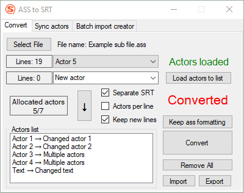
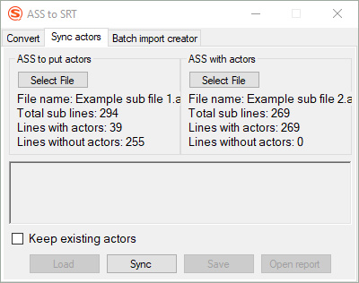

# AssToSrtConverter
Convert from ASS format to SRT format with actors allocation option<br>
Allocate actors from one ASS file to another

## Preview
 

Converted srt files saved in same path as initial ass file<br>
- [Convert options](#convert-options)
- [Actors synchronization](#actors-synchronization)
<br>

---
## Functionality
- Removes dublicate lines (not same with removing dublicate text)
- Removes vector drawing lines
<br>

- Total actors counter and allocated actors counter (Right clicking on counter gives option to see and choose not allocated actors)
- Shows how many subtitles are without actors (To see move cursor to `Actors loaded` label)
<br>
  
- Save new actors (Added/removed to list by clicking on `+`/`-` button. After actors added/removed `Save` button saves changes)
- Import or Export new actors attached to old actors ([Import/Export file sytax](#importexport-file-sytax))
<br>

- Synchronize actors of one ASS file with actors of another ASS file
- Load synchronized ASS file to converter
- Save synchronized ASS file

## Convert options
After selecting or dragging and dropping ass file 

---
### Option №1 (Default convertion)
Click to `Convert` button

---
### Option №2 (Convertion without removing text formatting)
Double click to `Converted` label 
(Clipboard will be overwritten with `Converted` text)

---
### Options with Actors


---
#### Option №3 (Convert with actors written on each text line)
Double click to `Actors loaded` label
(Clipboard will be overwritten with `Actors loaded` text)


Click to `Convert` button

---
#### Option №4 (Convert to separate srt files for each actor)
Same as in Option №3 but select `Separate SRT` checkbox


Click to `Convert` button

---
### Options with replacing actors with new actors


---
#### Option №5 (Convert with new actors written on each text line)
Select actor from loaded actors


Write down new actor


Click to button with arrow.


After needed actors allocated click to `Convert` button

---
#### Option №6 (Convert to separate srt files for each new actor)
Same as in Option №5 but select `Separate SRT` checkbox


Click to `Convert` button

---
#### Option №7 (Convert to separate srt files for each new actor with old actors written on each text line)
Same as in option №6 but select `Actors per line` checkbox


Click to `Convert` button

---
## Import/Export file sytax
Can be imported with drag and drop to `To change` box
```
Actor 1:Changed actor 1
Actor 2:Changed actor 2
Actor 3:Multiple actors
Actor 4:Multiple actors
Text:Changed Text
```

---
## Actors synchronization
**There can be wrong allocations so you need to check manually for correctness of allocated actors**

Takes actors from ASS file on the right side and allocates them in ASS file on the left side.


<br>

Not allocated actors written in report box with number of line in ASS file and timing of the text.


`Open report` button opens report in larger window with option to copy report to clipboard.
