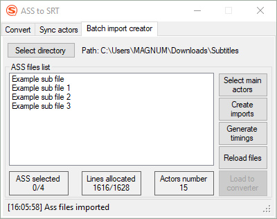
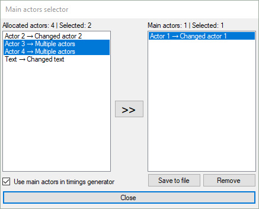

# AssToSrtConverter
Convert subtitles from ASS to SRT format with actor allocation options<br>
Allocate actors from one ASS file to another<br>
Create batch import files for easier actor allocation

## Preview
  

Converted srt files saved in same path as initial ass file<br>
- [Convert options](#convert-options)
- [Actors synchronization](#actors-synchronization)
- [Batch import creator](#batch-import-creator)
<br>

---
## Functionality
- Removes dublicate lines (not same with removing dublicate text)
- Removes vector drawing lines
<br>

- Right clicking on `Allocated actors` counter gives option to see and choose not allocated actors
- Shows how many subtitle lines are without actors (To see hover mouse cursor over `Actors loaded` label)
- Shows subtitle number for each actor/changed actor (To see choose needed actor in first/second drop down list)
- Import or Export allocated actors ([Import/Export file sytax](#importexport-file-sytax))
<br>

- Synchronize actors of one ASS file with actors of another ASS file
- Load synchronized ASS file to converter
- Save synchronized ASS file
<br>

- Create batch import files
- Generate timings for unallocated actors
- Load ASS file and its import file to converter
<br>

---
## Convert options
After selecting or dragging and dropping ass file<br>
*(`Keep new lines` checkbox ensures that new lines converted from ASS format to SRT format.<br>Uncheck if you want each subtitle to be in one line)*

---
### Option №1 (Default convertion)
Click to `Convert` button

---
### Option №2 (Default convertion without removing ass formatting)
Click to `Keep ass formatting` button<br>
*For example if there is something like `{\an7\fs16\shad0\frz18.41\c&H232824&\3c&HFEFFFD&\pos(62,75)}` in front of text it will be kept as it is in SRT.*

---
### Options with Actors


---
#### Option №3 (Convert with actors written on each text line)
Click to `Load actors to list` button<br>
Click to `Convert` button

---
#### Option №4 (Convert to separate srt files for each actor)
Same as in Option №3 but select `Separate SRT` checkbox<br>
Click to `Convert` button

---
### Options with replacing actors with new actors


---
#### Option №5 (Convert with new actors written on each text line)
Select actor from first drop down list<br>
Write down new actor<br>
Click to button with arrow.<br>
After needed actors allocated click to `Convert` button

---
#### Option №6 (Convert to separate srt files for each new actor)
Same as in Option №5 but select `Separate SRT` checkbox<br>
Click to `Convert` button

---
#### Option №7 (Convert to separate srt files for each new actor with old actors written on each text line)
Same as in option №6 but select `Actors per line` checkbox<br>
Click to `Convert` button

---
## Import/Export file sytax
This is simple text file which can be loaded with `Import` button or with drag and drop to `Actors list` box
```
Actor 1:Changed actor 1
Actor 2:Changed actor 2
Actor 3:Multiple actors
Actor 4:Multiple actors
Actor 5:
EMPTY ACTOR:
Text:Changed Text
```

---
## Actors synchronization
**There can be wrong synchronizations so you need to check manually for correctness of synced actors**

Takes actors from ASS file on the right side and allocates them in ASS file on the left side according to the start and end time of text lines.<br>


<br>

Not synced lines written in report box with number of line in ASS file and timing of the text.<br>


`Open report` button opens report in larger window with option to copy report to clipboard.

---
## Batch import creator
If you have folder with .ass subtitles for different episodes of TV Show and in those subtitles there are same actors this tab will help you to create import files for `Convert` tab so you can use [Options with replacing actors with new actors](#options-with-replacing-actors-with-new-actors)<br>

*If in folder that you try to select or drag and drop there are no actors in ass files or no ass files at all forlder won't be imported.*<br>
<br>

**All files from this tab will be saved in subfolder named `Actors to import` which will be located in same folder as subtitle files, so if you have created import files before move them in `Actors to import` subfolder**<br>

Example folder tree:
```
+-- Subtitles
  |-- Actors to import
      |-- [Import] Example sub file.txt
      |-- [Import] Example sub file 1.txt
      |-- [Import] Example sub file 2.txt
      |-- [Import] Example sub file 3.txt
      |-- Actors main.txt
  |-- Example sub file.ass
  |-- Example sub file 1.ass
  |-- Example sub file 2.ass
  |-- Example sub file 3.ass
```

- `Lines allocated` label shows count of [lines with actors/total line numbers] for all selected files. (If no files selected shows conut for all files in the list)
- `Actors number` label shows number of distinct actors for all selected files. (If no files selected shows number of distinct actors for all files in the list)<br>

*To unselect all files select one file and then with Ctrl pressed select same file again*
<br>

---
### What buttons do
- [Select main actors](#select-main-actors)
- [Create imports](#create-imports)
- [Generate timings](#generate-timings)
- [Reload files](#reload-files)
- [Load to converter](#load-to-converter)

---
#### Select main actors
Shows new form with allocated actors of selected files in `ASS files list`<br>
Actors from this form will be used while creating import files.<br>
<br>

- `Save to file` button will save main actors to `Actors main.txt` file in `Actors to import` subfolder<br>
*If form closed without saving to file, main actors will be saved when new folder imported, same folder reloaded, or application closed*
- While form opened you can change selected items in `ASS files list`
<br>

When importing new folder or reimporting same folder with subtitles if there were no import files with allocated actors<br>
or `Actors main.txt` file with allocated actors in `Actors to import` subfolder<br>
then `Main actors selector` form will be empty.

---
#### Create imports
For selected files (or for all files if no files selected) creates import files in `Actors to import` subfolder.<br>
- For each actor in file allocates new actor from main actors
- If main actors does not have needed actor with new actor attached the actor in import file will remain unallocated
<br>

When importing new folder or reimporting same folder with subtitles if there were no import files with allocated actors<br>
or `Actors main.txt` file with allocated actors in `Actors to import` subfolder<br>
then created import files will contain unallocated actors only, so later you can manually allocate new actors in text editor.

---
#### Generate timings
For selected files (or for all files if no files selected) generates timings of unallocated actors.
- For each new file excludes actors that were in previous files. (If you want to see all unallocated actors in file generate timings selecting only one file in the list)
- For each actor generates only first three text lines with its timings if there are more than three text lines
<br>

*If only one file selected then file name will be `[Timings] {selected ass file name}.txt` otherwise `timings.txt`*
<br>

Generated `timings.txt` file for first two selected files in the list
```
== Example sub file => [Empty actors: 2] ==
[Actor 2] - 20 line(s)
(00:34 - 00:37) Example text line 5
(00:37 - 00:40) Example text line 6
(00:41 - 00:48) Example text line 7

[Actor 3] - 2 line(s)
(01:12 - 01:15) Example text line 13
(01:23 - 01:25) Example text line 15

== Example sub file 1 => [Empty actors: 2] ==
[Actor 6] - 1 line(s)
(04:30 - 04:32) Example text line 81

[Actor 7] - 15 line(s)
(10:55 - 10:57) Example text line 224
(11:03 - 11:07) Example text line 228
(13:06 - 13:09) Example text line 263
```

---
#### Reload files
Already imported folder will be reimported.<br>

Needed if you made changes to .ass files or import files in `Actors to import` subfolder.<br>
If you made changes to `Actors main.txt` file in `Actors to import` subfolder it will be overwritten, so it is better to do changes for main actors in `Main actors selector` form which appears when you press on `Select main actors` button or when the application is closed.<br>

*Already imported folder can be reimported only with this button and won't be reimported with `Select directory` button or drag and drop to the list of ass files*

---
#### Load to converter
Selected file will be loaded to `Convert` tab with it's import file if there are any allocated actors.
